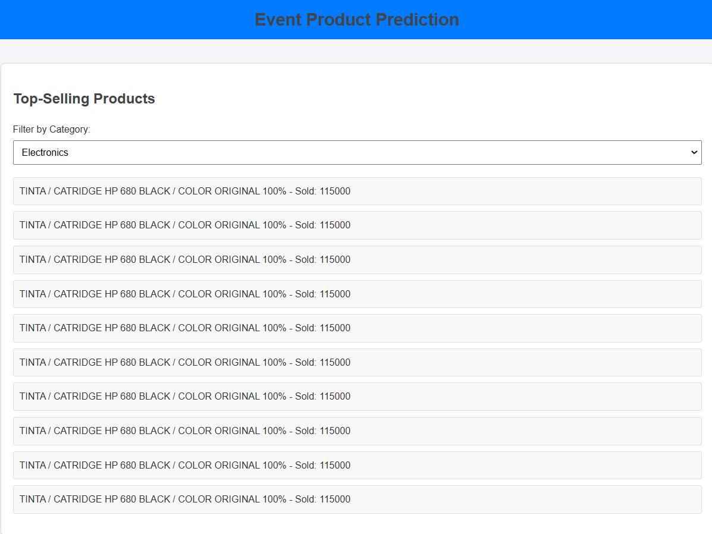
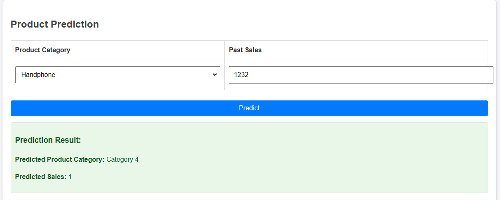
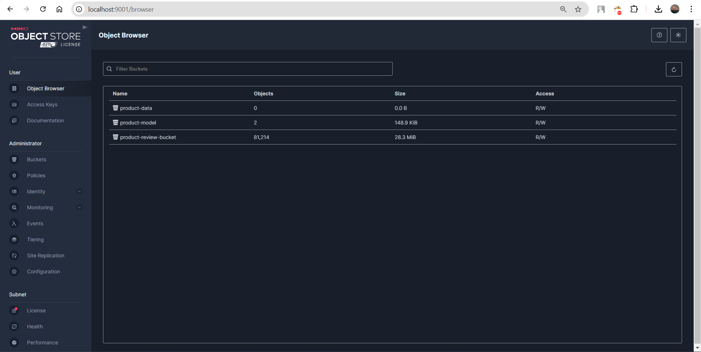
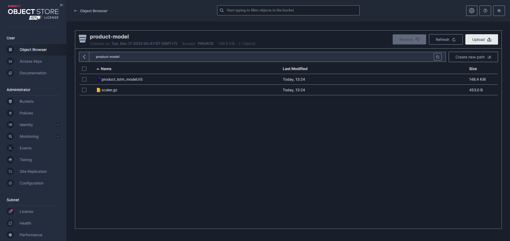
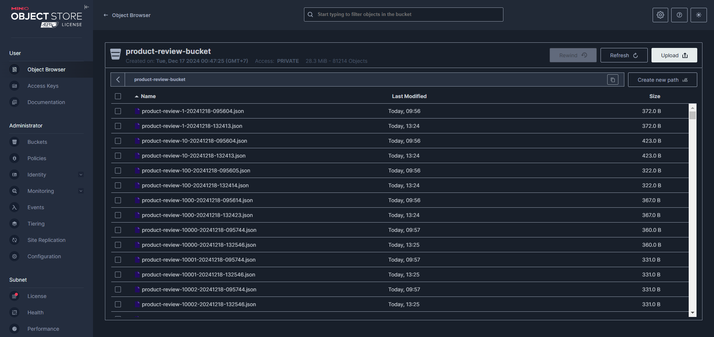

# Final Project Big Data dan Data Lakehouse 
## Anggota Kelompok
| Nrp | Anggota Kelompok |
| --- | --- |
| 5027221038 | Dani Wahyu Anak Ary |
| 5027221048 | Malvin Putra Rismahardian |
| 5027221084 | Farand Febriansyah |
| 5027221088 | Veri Rahman |

## Overview
Implementasi Data Lakehouse pada Tokopedia yang dilengkapi dengan dashboard barang yang paling banyak terjual serta prediksi kategori barang yang akan ramai terjual.

## Dataset
https://www.kaggle.com/datasets/farhan999/tokopedia-product-reviews/data

## Arsitektur


## How to run?
### Quick start
- Run start.sh (menjalankan docker, membuat kafka topic, menjalankan producer dan consumer, dan melatih model)
```bash
bash start.sh
```
- Run main
```bash
cd main
python3 api/app.py 
python3 kafka/consumer.py
```

- Run web
```bash
cd main/web
python3 -m http.server 8080
```

### Step by step
1. Run Docker
```bash
docker-compose up -d
```

2. Buat kafka topics
```bash
docker exec -it kafka kafka-topics.sh --create --topic product-review --bootstrap-server localhost:9092 --partitions 1 --replication-factor 1
```
```bash
docker exec -it kafka kafka-topics.sh --create --topic product-input --bootstrap-server localhost:9092 --partitions 1 --replication-factor 1
```

3. Buka http://localhost:9001 dan login Minio dengan kredensial berikut
```txt
minio/minio123
```

4. Run preset
```bash
cd preset
python3 producer.py
python3 consumer.py
python3 train.py
```

5. Run main
```bash
cd main
python3 api/app.py 
python3 kafka/consumer.py
```

6. Run web
```bash
cd main/web
python3 -m http.server 8080
```

## Endpoint
### 1. Mengambil Daftar Produk Terlaris
**Endpoint:** 
`GET /top-sold-products`

**Deskripsi:**  
Mengambil daftar produk terlaris, dengan opsi untuk memfilter berdasarkan kategori.

**Parameter Query:**  
| Parameter   | Tipe   | Deskripsi                                | Contoh          |
|-------------|--------|------------------------------------------|-----------------|
| `category`  | string | (Opsional) Filter produk berdasarkan kategori. | `elektronik`   |

**Contoh Permintaan:**  
```txt
GET http://localhost:5000/top-sold-products?category=elektronik
```

**Contoh Respon:**  
```json
{
    "top_products": [
        {
            "product_name": "Mouse Wireless",
            "category": "elektronik",
            "sold": 1200
        },
        {
            "product_name": "Headphone Bluetooth",
            "category": "elektronik",
            "sold": 950
        }
    ]
}
```

### 2. Memprediksi Produk Terlaris
**Endpoint:** 
`POST /predict`

**Deskripsi:**  
Memprediksi kategori produk terlaris dan jumlah penjualan yang diharapkan berdasarkan fitur input.

**Request Body:**
Permintaan POST harus menyertakan payload JSON seperti berikut:

| Kunci   | Tipe   | Deskripsi                                | Contoh          |
|-------------|--------|------------------------------------------|-----------------|
| `features`  | array | Array fitur:`[category, sales]` | `[1,500]`   |

**Penjelasan Fitur:**

- `category` - Angka integer yang merepresentasikan kategori produk:
    - 1: Elektronik
    - 2: Fashion
    - 3: Olahraga
    - 4: Handphone
    - 5: Peralatan Rumah Tangga

- `sales` - Angka yang merepresentasikan jumlah penjualan sebelumnya.

**Contoh Permintaan:**  
```json
{
    "features": [2, 300]
}
```

**Contoh Respon:**  
```json
{
    "product": "Fashion",
    "sales": 10
}

```

## Output
### Tampilan Web
1. Tampilan top produk yang terjual berdasarkan kategori


2. Tampilan prediksi kategori barang yang akan terjual


### Tampilan MiniO
1. Dashboard


2. Bucket Model (tempat menaruh model)


3. Bucket Database (tempat data json)

